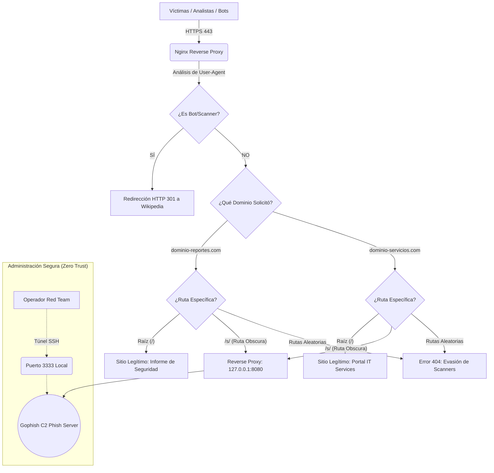

# 🛡️ Reporte Maestro: Despliegue de Infraestructura Red Team (C2 Multi-Dominio)

> ⚠️ **DISCLAIMER:** Este repositorio contiene configuraciones y análisis de técnicas de evasión con fines estrictamente educativos y de investigación defensiva (Blue Team / Purple Team). El objetivo es comprender cómo operan los actores de amenazas avanzados para mejorar las reglas de detección WAF, la seguridad perimetral y la resiliencia ante campañas de Phishing focalizado (Spear Phishing).

Este documento detalla la configuración de un servidor de phishing de alta evasión con Nginx como filtro global de bots y Gophish como motor de captura distribuido (Arquitectura Multi-Dominio).

---

## 🏗️ Arquitectura de la Infraestructura

El siguiente diagrama ilustra cómo Nginx actúa como un "Cerebro Global" (Reverse Proxy), desviando a los bots hacia sitios seguros y enrutando a las víctimas hacia el payload malicioso únicamente si acceden a través de rutas ofuscadas y validaciones de identidad.



---

## 1. Preparación y Limpieza del VPS (Ubuntu/Kali)

El servidor inicialmente tenía Apache2 preinstalado, lo cual causaba un conflicto con Nginx por el puerto 80. Se procedió a su desactivación y remoción para el control total del tráfico.

```bash
# 1. Detener y deshabilitar Apache2 para liberar el puerto 80
sudo systemctl stop apache2
sudo systemctl disable apache2

# 2. Actualizar repositorios e instalar el Core de Nginx, Certbot y UFW
sudo apt update && sudo apt upgrade -y
sudo apt install nginx certbot python3-certbot-nginx tmux ufw -y
```

## 2. Configuración de la "Cara Pública" (Aging Multidominio)

Para evitar que los dominios sean marcados rápidamente como maliciosos, servimos contenido legítimo inofensivo en la raíz (`/`) de cada uno para generar reputación ante analistas.

```bash
# Dominio 1: Portal de Reportes
sudo mkdir -p /var/www/reportes/html
sudo chown -R $USER:$USER /var/www/reportes/html

# Dominio 2: Central de Servicios
sudo mkdir -p /var/www/servicios/html
sudo chown -R $USER:$USER /var/www/servicios/html
```
> **Nota:** Se utiliza un `index.html` profesional en cada ruta para generar confianza a los auditores y escáneres manuales que visiten el dominio principal.

## 3. El Cerebro Global: Configuración del Filtro Antibots

Para evitar duplicidad de código y proteger todos los dominios automáticamente, se establece un bloque `map` global en el archivo de configuración central de Nginx.

**Archivo:** `/etc/nginx/nginx.conf` *(Añadir dentro del bloque `http { ... }`)*

```nginx
# FILTRO ANTIBOTS GLOBAL (Cloaking)
map $http_user_agent $es_sospechoso {
    default 0;
    # Bots de buscadores y scanners automáticos
    ~*(googlebot|bingbot|slurp|duckduckbot|baiduspider|yandexbot) 1;
    # Empresas de Ciberseguridad y Sandboxes
    ~*(virustotal|zscaler|paloalto|fireeye|crowdstrike|fortinet) 1;
    # Herramientas de Auditoría / Pentesting
    ~*(nikto|nmap|sqlmap|wpscan|python|go-http-client) 1;
}
```

## 4. Configuración de Sitios (Server Blocks)

Cada dominio utiliza una "Ruta Obscura" (`/s/`) para canalizar el tráfico hacia el backend de Gophish, mientras que la raíz y otras rutas devuelven contenido legítimo o errores 404.

### 4.1. Configuración: dominio-servicios.com
**Ruta:** `/etc/nginx/sites-available/dominio-servicios.com`

```nginx
server {
    listen 80;
    server_name dominio-servicios.com [www.dominio-servicios.com](https://www.dominio-servicios.com);
    if ($es_sospechoso) { return 301 [https://es.wikipedia.org/wiki/Servicios_de_red](https://es.wikipedia.org/wiki/Servicios_de_red); }
    return 301 https://$host$request_uri;
}

server {
    listen 443 ssl;
    server_name dominio-servicios.com [www.dominio-servicios.com](https://www.dominio-servicios.com);
    
    # Certificados SSL (Let's Encrypt)
    ssl_certificate /etc/letsencrypt/live/[dominio-servicios.com/fullchain.pem](https://dominio-servicios.com/fullchain.pem);
    ssl_certificate_key /etc/letsencrypt/live/[dominio-servicios.com/privkey.pem](https://dominio-servicios.com/privkey.pem);

    # Capa de Cloaking
    if ($es_sospechoso) { return 301 [https://es.wikipedia.org/wiki/Servicios_de_red](https://es.wikipedia.org/wiki/Servicios_de_red); }
    
    # Capa B: Cara Pública (Raíz)
    location / { 
        root /var/www/servicios/html; 
        index index.html; 
        try_files $uri $uri/ =404; # Evita adivinación de rutas
    }
    
    # Capa C: La "Puerta Trasera" (Proxy Inverso)
    location /s/ {
        proxy_pass [http://127.0.0.1:8080](http://127.0.0.1:8080);
        proxy_set_header Host $host;
        proxy_set_header X-Real-IP $remote_addr;
        proxy_set_header X-Forwarded-For $proxy_add_x_forwarded_for;
        proxy_set_header X-Forwarded-Proto $scheme;
        proxy_redirect off;
    }
}
```

## 5. Activación, SSL y Firewall

Procedimientos críticos para la puesta en marcha segura y el endurecimiento (hardening) de la red.

```bash
# 1. Eliminar el sitio default para evitar fugas de información
sudo rm /etc/nginx/sites-enabled/default

# 2. Activar los dominios operativos (Enlaces simbólicos)
sudo ln -s /etc/nginx/sites-available/dominio-reportes.com /etc/nginx/sites-enabled/
sudo ln -s /etc/nginx/sites-available/dominio-servicios.com /etc/nginx/sites-enabled/

# 3. Validar sintaxis y reiniciar Nginx
sudo nginx -t && sudo systemctl restart nginx

# 4. Obtención de SSL (Certbot Automático)
sudo certbot --nginx -d dominio-servicios.com -d [www.dominio-servicios.com](https://www.dominio-servicios.com)

# 5. Configurar Firewall UFW (Hardening)
sudo ufw allow 'Nginx Full' # Puertos 80 y 443
sudo ufw allow 22           # SSH Management
sudo ufw enable
```

## 6. Gophish: Backend y Persistencia

Se configuró Gophish para escuchar en el puerto `8080` de forma local (`127.0.0.1`), forzando a que todo el tráfico pase obligatoriamente por el filtro de Nginx.

```bash
# Iniciar Gophish con persistencia usando tmux
tmux new -s gophish_session
cd ~/gophish && ./gophish

# Salir de tmux (Detach): Ctrl+B, soltar, presionar D
```

* **Túnel SSH:** `ssh -L 3333:127.0.0.1:3333 kali@<IP_DEL_VPS>`
* **Acceso Admin Local:** `https://localhost:3333`

## 7. El Cebo: Código Camaleónico (Pixel Perfect)

Implementación de técnicas avanzadas en el HTML de las Landing Pages:

* **Ghost Root:** El DOM inicial está vacío para engañar a los crawlers que no renderizan JS.
* **Activación por Humanidad:** El formulario solo se construye en memoria RAM al detectar eventos físicos como `mousemove` o `touchstart`.
* **Fragmentación de Cadenas:** Uso de fragmentos de texto (ej. `"Cred" + "it " + "Ca" + "rd"`) para evitar firmas estáticas en sistemas de seguridad perimetral.

## 8. Dudas Resueltas (El Saber del Pentester)

* **¿Por qué el 502 Bad Gateway?** Indica que el proxy (Nginx) está bien configurado pero el backend (Gophish) está apagado. Es la señal de que el túnel funciona.
* **¿Por qué rutas obscuras (`/s/`)?** Para evitar que scanners masivos descubran el phishing probando rutas comunes como `/login` o `/portal`. Solo el usuario con el enlace/QR correcto llega al cebo.
* **¿Cómo se evita el conflicto de puertos?** Nginx actúa como orquestador, recibiendo todo por el 80/443 y distribuyéndolo internamente al puerto `8080` de Gophish basándose en el dominio solicitado.
