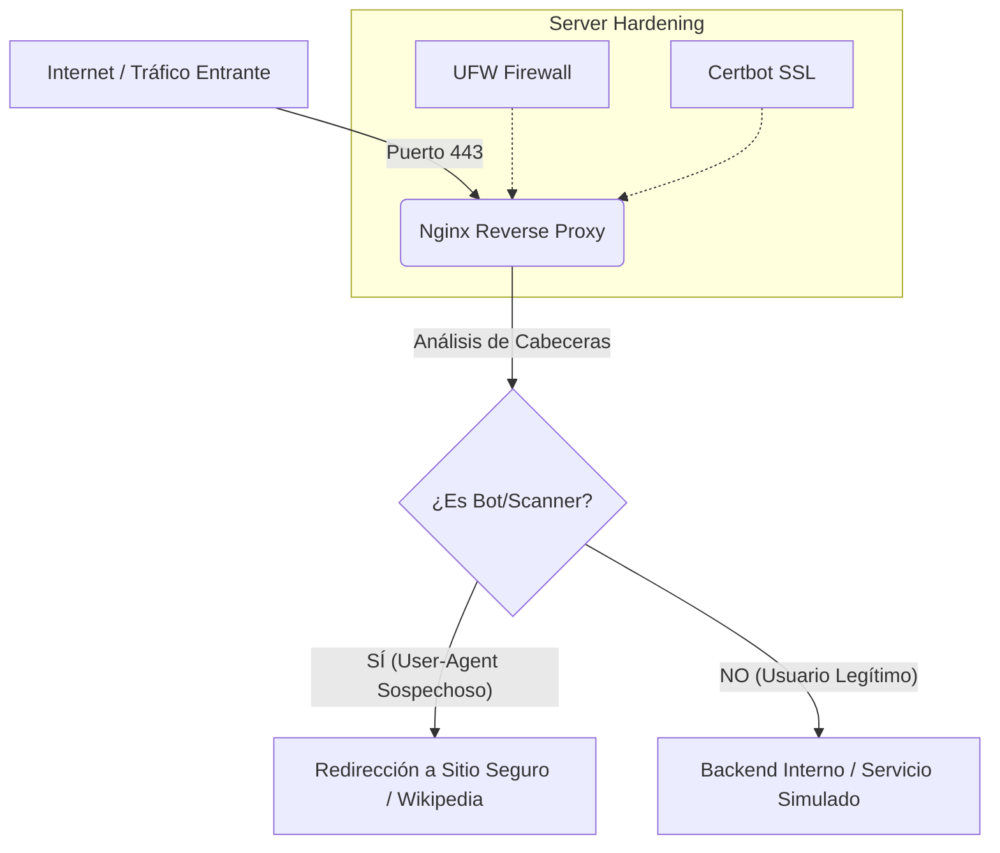

# Investigación: Nginx Reverse Proxy & Traffic Filtering Analysis

> ⚠️ **DISCLAIMER:** Este repositorio contiene configuraciones y análisis de técnicas de evasión con fines estrictamente educativos y de investigación defensiva (Blue Team/Purple Team). El objetivo es comprender cómo operan los actores de amenazas para mejorar las reglas de detección WAF y la seguridad perimetral.

## 📋 Resumen del Proyecto

Esta investigación documenta el despliegue de una infraestructura web resiliente utilizando **Nginx** como Proxy Inverso y filtro de tráfico (WAF básico). Se analiza cómo configurar reglas de filtrado basadas en *User-Agent* para distinguir entre tráfico legítimo, bots de indexación y escáneres de vulnerabilidades.

Adicionalmente, se documenta una **Prueba de Concepto (PoC)** sobre técnicas de evasión en el lado del cliente (*Client-Side Evasion*) para demostrar cómo el código malicioso puede ocultarse de los análisis estáticos.

---

## 🏗️ Arquitectura de la Infraestructura

La infraestructura se diseñó para simular un entorno corporativo protegido, donde Nginx actúa como la primera línea de defensa, decidiendo qué tráfico pasa al backend y cuál es desviado.



## 🛡️ Configuración Defensiva: Filtrado de Bots (Cloaking Logic)

Se implementó una lógica de filtrado en Nginx para identificar y bloquear herramientas de escaneo automatizado (Nikto, Nmap, Sqlmap) y bots de análisis de seguridad.

**Snippet de Configuración (`nginx.conf`):**

```nginx
# Lógica de Mapa para Detección de Bots
map $http_user_agent $es_trafico_sospechoso {
    default 0;
    # Bloqueo de Scanners de Seguridad Conocidos
    ~*(virustotal|zscaler|paloalto|fireeye|crowdstrike|fortinet) 1;
    # Bloqueo de Herramientas de Pentesting
    ~*(nikto|nmap|sqlmap|wpscan|python|go-http-client) 1;
}

server {
    listen 80;
    server_name research-lab.online;

    # Regla de Filtrado (WAF)
    if ($es_trafico_sospechoso) {
        # Desvío de tráfico malicioso a un sitio neutral
        return 301 [https://es.wikipedia.org/wiki/Seguridad_informática](https://es.wikipedia.org/wiki/Seguridad_informática);
    }

    # Tráfico Legítimo
    location / {
        root /var/www/html/landing-legitima;
        index index.html;
    }
}
```

## 🕵️‍♂️ Análisis de Técnica de Evasión: "Chameleon Payload"

Como parte de la investigación ofensiva (Red Teaming), se analizó cómo los atacantes utilizan JavaScript para construir formularios maliciosos únicamente en la memoria RAM del navegador, evadiendo así los filtros de correo y los escáneres de red que buscan palabras clave (como "contraseña" o "banco") en el código fuente estático.

**Mecanismo de Evasión Identificado:**
1.  **Fragmentación de Strings:** Las palabras clave se dividen y concatenan en tiempo de ejecución ("Num" + "ero de " + "Tarjeta").
2.  **Activación por Interacción Humana:** El contenido malicioso no se carga hasta que se detecta movimiento del mouse (`mousemove`), engañando a los sandboxes automatizados que no interactúan.
3.  **Carga Dinámica:** El DOM se inyecta mediante `document.write` o manipulación de `innerHTML` post-carga.

**Snippet de Análisis (PoC JavaScript):**

```javascript
/* LÓGICA DE EVASIÓN (PoC) */
// El código HTML malicioso no existe en el archivo estático.
// Se genera dinámicamente para evadir firmas estáticas.

const UI_Elements = {
    label_1: "User" + "name", // Fragmentación
    label_2: "Pass" + "word"
};

// El formulario solo se renderiza si hay actividad humana real
window.addEventListener('mousemove', () => {
    const root = document.getElementById('ghost-root');
    root.innerHTML = `
        <form method="POST">
            <label>${UI_Elements.label_1}</label>
            <input type="text" name="u">
        </form>
    `;
}, { once: true });
```

## ⚙️ Hardening del Servidor (Pasos de Reproducción)

Para asegurar el servidor de pruebas, se aplicaron las siguientes políticas de seguridad:

* **Firewall (UFW):** Política de denegación por defecto. Solo puertos 80 (HTTP), 443 (HTTPS) y SSH (restringido) permitidos.
* **SSL/TLS:** Implementación de certificados Let's Encrypt para cifrado en tránsito.
* **Gestión de Procesos:** Uso de `tmux` para persistencia de servicios backend sin exponer consolas.
* **Túneles SSH:** Administración remota segura mediante `ssh -L` para evitar exponer paneles de administración a internet pública.

```bash
# Ejemplo de endurecimiento con UFW
sudo ufw default deny incoming
sudo ufw allow 'Nginx Full'
sudo ufw allow ssh
sudo ufw enable
```

## 📝 Conclusiones de la Investigación

* **Eficacia del Filtrado:** El filtrado por *User-Agent* en Nginx es efectivo contra escaneos automatizados básicos, pero debe complementarse con análisis de comportamiento (Rate Limiting).
* **Riesgo de Evasión:** Las técnicas de construcción de DOM en el lado del cliente (*Client-Side Rendering*) representan un desafío significativo para los WAFs tradicionales, requiriendo soluciones de seguridad que inspeccionen la ejecución del JavaScript y no solo el código estático.
